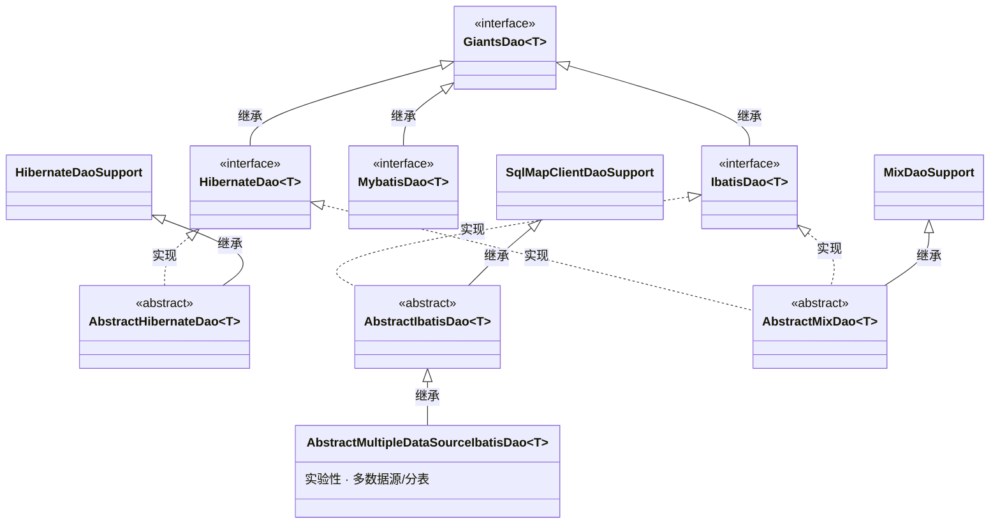

# giants-dal 使用手册

本手册详细介绍 giants-dal 数据访问层组件的架构、各 ORM 实现的用法、配置方式与约定。

## 目录

1. [概述与架构](#1-概述与架构)
2. [核心接口 GiantsDao](#2-核心接口-giantsdao)
3. [iBATIS 用法](#3-ibatis-用法)
4. [Hibernate 用法](#4-hibernate-用法)
5. [MyBatis 用法](#5-mybatis-用法)
6. [Mix 混合模式用法](#6-mix-混合模式用法)
7. [iBATIS Spring 集成层](#7-ibatis-spring-集成层)
8. [LOB 大字段处理](#8-lob-大字段处理)
9. [分库分表（实验性）](#9-分库分表实验性)
10. [常见问题与注意事项](#10-常见问题与注意事项)

---

## 1. 概述与架构

giants-dal 的核心思想是：**用一套统一的 DAO 接口 `GiantsDao<T>` 抽象常见数据访问操作，在其下提供多种 ORM 框架的具体实现**。使用者只需继承对应的抽象类，即可获得完整的 CRUD 能力，无需重复编写样板代码。

### 继承体系



### 泛型实体自动识别

各抽象 DAO 通过泛型反射自动获取实体类型：

```java
private final Class<T> entityClass = (Class<T>) ((ParameterizedType) getClass()
        .getGenericSuperclass()).getActualTypeArguments()[0];
```

因此 `get(id)`、`loadAll()` 等方法无需手动传入实体 `Class`，直接从泛型参数推断。

> 注意：这依赖于**直接子类**在继承时显式声明泛型（如 `class UserDao extends AbstractIbatisDao<User>`）。若中间存在未指定泛型的抽象层，反射会失败。

---

## 2. 核心接口 GiantsDao

`com.giants.dal.dao.GiantsDao<T>` 定义了所有 ORM 实现共享的操作契约：

| 方法 | 说明 |
| --- | --- |
| `void insert(T entity)` | 插入单个实体 |
| `void update(T entity)` | 更新单个实体 |
| `void insertAll(List<T> entityList)` | 批量插入 |
| `void delete(T entity)` | 删除单个实体 |
| `void deleteAll(List<T> entityList)` | 批量删除 |
| `T get(Serializable id)` | 按主键获取，不存在返回 `null` |
| `T load(Serializable id)` | 按主键加载 |
| `List<T> loadAll()` | 加载全部 |
| `Date getCurrentDatetime()` | 获取数据库当前时间 |
| `T findOneEntityByExample(T exampleEntity)` | 按例查询单条 |
| `List<T> findByExample(T exampleEntity)` | 按例查询列表 |
| `List<T> searchForEntityList(String statementName, Object parameterBean)` | 命名查询返回实体列表 |
| `int searchForCount(String statementName, Object parameterBean)` | 命名查询返回计数 |

各实现之间的语义差异见下文对应章节。

---

## 3. iBATIS 用法

### 3.1 基本步骤

**第一步：编写 DAO 类**

```java
package com.example.dao;

import com.giants.dal.dao.ibatis.AbstractIbatisDao;
import com.example.domain.User;

public class UserDao extends AbstractIbatisDao<User> {
    // 继承即拥有全部 CRUD 能力，无需编写任何方法
}
```

**第二步：遵循语句命名约定编写 SqlMap**

iBATIS 实现会将 SQL 语句名拼接为 `实体类简单名.操作名`。操作名常量定义在 `DalConstants` 中：

| 常量 | 值 | 对应方法 |
| --- | --- | --- |
| `IBATIS_STATEMENT_INSERT` | `insert` | `insert` / `insertAll` |
| `IBATIS_STATEMENT_UPDATE` | `update` | `update` |
| `IBATIS_STATEMENT_DELETE` | `delete` | `delete` / `deleteAll` |
| `IBATIS_STATEMENT_GETBYID` | `getById` | `get` / `load` |
| `IBATIS_STATEMENT_GETALL` | `getAll` | `loadAll` |
| `IBATIS_STATEMENT_EXAMPLE` | `findByExample` | `findByExample` / `findOneEntityByExample` |
| `IBATIS_STATEMENT_CURRENT_TIME` | `getCurrentDatetime` | `getCurrentDatetime` |

例如实体类为 `User`，则 `insert(user)` 实际执行的语句名为 `User.insert`。

```xml
<sqlMap namespace="User">
    <insert id="User.insert" parameterClass="com.example.domain.User">
        INSERT INTO t_user (name, email) VALUES (#name#, #email#)
    </insert>
    <update id="User.update" parameterClass="com.example.domain.User">
        UPDATE t_user SET name = #name#, email = #email# WHERE id = #id#
    </update>
    <delete id="User.delete" parameterClass="com.example.domain.User">
        DELETE FROM t_user WHERE id = #id#
    </delete>
    <select id="User.getById" parameterClass="long"
            resultClass="com.example.domain.User">
        SELECT id, name, email FROM t_user WHERE id = #value#
    </select>
    <select id="User.getAll" resultClass="com.example.domain.User">
        SELECT id, name, email FROM t_user
    </select>
    <select id="User.findByExample" parameterClass="com.example.domain.User"
            resultClass="com.example.domain.User">
        SELECT id, name, email FROM t_user
        <dynamic prepend="WHERE">
            <isNotNull property="name"> AND name = #name# </isNotNull>
        </dynamic>
    </select>
</sqlMap>
```

> `getCurrentDatetime` 直接使用短语句名 `getCurrentDatetime`（不带实体前缀）。

**第三步：Spring 装配**

```xml
<!-- iBATIS SqlMapClient（使用本组件提供的 FactoryBean） -->
<bean id="sqlMapClient"
      class="com.giants.dal.orm.ibatis.SqlMapClientFactoryBean">
    <property name="configLocation" value="classpath:sql-map-config.xml"/>
    <property name="dataSource" ref="dataSource"/>
</bean>

<!-- DAO -->
<bean id="userDao" class="com.example.dao.UserDao">
    <property name="sqlMapClient" ref="sqlMapClient"/>
</bean>
```

### 3.2 自定义命名查询

`IbatisDao<T>` 在 `GiantsDao` 基础上增加了：

```java
List<Object> searchForBeanList(String statementName, Object parameterBean);
```

- `searchForEntityList(name, param)` —— 返回实体列表（结果类型 `T`）
- `searchForBeanList(name, param)` —— 返回任意对象列表（如统计 VO、非实体结果）
- `searchForCount(name, param)` —— 返回 `int` 计数

这三个方法同样遵循 `实体类名.name` 的拼接约定。例如：

```java
public class UserDao extends AbstractIbatisDao<User> {
    public List<User> findActiveUsers(UserQuery query) {
        // 实际执行语句名 User.findActive
        return searchForEntityList("findActive", query);
    }
}
```

### 3.3 子类可用的 protected 快捷方法

`AbstractIbatisDao` 提供了一组受保护方法，供子类封装自定义 SQL（均按 `实体类名.sqlName` 拼接语句名）：

| 方法 | 说明 |
| --- | --- |
| `List findBySqlName(String sqlName)` / `(sqlName, param)` | 查询列表 |
| `Object findSingleBySqlName(String sqlName)` / `(sqlName, param)` | 查询单条 |
| `void insertBySqlName(String sqlName)` / `(sqlName, param)` | 插入 |
| `int updateBySqlName(String sqlName)` / `(sqlName, param)` | 更新，返回影响行数 |
| `int deleteBySqlName(String sqlName)` / `(sqlName, param)` | 删除，返回影响行数 |

### 3.4 批量操作

`insertAll` / `deleteAll` 基于 iBATIS 的 `startBatch()` + `executeBatchDetailed()` 实现真正的批处理，并封装在 `SqlMapClientCallback` 中执行：

```java
userDao.insertAll(userList);  // 批量插入，单次批处理提交
userDao.deleteAll(userList);  // 批量删除
```

批处理失败会抛出 `SQLException`（由 `BatchException` 转换而来）。

### 3.5 SQL 执行性能监控

`AbstractIbatisDao` 对每次 SQL 执行进行计时：

- 执行时间 **超过** `sqlExecuteThreshold`（默认 **200ms**）→ 记录 `WARN` 日志；
- 否则记录 `INFO` 日志。

可通过 setter 调整阈值：

```xml
<bean id="userDao" class="com.example.dao.UserDao">
    <property name="sqlMapClient" ref="sqlMapClient"/>
    <property name="sqlExecuteThreshold" value="500"/>  <!-- 单位 ms -->
</bean>
```

日志基于 SLF4J，内容包含语句名、参数与耗时。

---

## 4. Hibernate 用法

### 4.1 基本步骤

```java
package com.example.dao;

import com.giants.dal.dao.hibernate.AbstractHibernateDao;
import com.example.domain.User;

public class UserDao extends AbstractHibernateDao<User> {
}
```

Spring 装配：

```xml
<bean id="userDao" class="com.example.dao.UserDao">
    <property name="sessionFactory" ref="sessionFactory"/>
</bean>
```

`HibernateDaoSupport` 支持注入 `sessionFactory`（自动创建 `HibernateTemplate`）或直接注入 `hibernateTemplate`。

### 4.2 Hibernate 扩展方法

`HibernateDao<T>` 在 `GiantsDao` 基础上增加：

| 方法 | 说明 |
| --- | --- |
| `void flush()` | 刷新 Session |
| `void clear()` | 清空 Session 一级缓存 |
| `void evict(T entity)` | 将实体逐出 Session |
| `T merge(T entity)` | 合并游离态实体 |
| `T insertOrUpdate(T entity)` | saveOrUpdate |
| `List<T> insertOrUpdateAll(List<T> entityList)` | 批量 saveOrUpdate |

### 4.3 语义说明

- `get(id)` → `HibernateTemplate.get()`，不存在返回 `null`；
- `load(id)` → `HibernateTemplate.load()`，返回代理，访问时不存在会抛异常；
- `findByExample` → 基于 Hibernate 的 Example 查询；
- `getCurrentDatetime()` → 执行原生 SQL `SELECT CURRENT_TIMESTAMP()`。

### 4.4 命名查询（HQL Named Query）

`searchForEntityList(statementName, parameterBean)` 会查找 Hibernate **命名查询**（`session.getNamedQuery`），并将 `parameterBean` 的属性绑定到查询参数；若 `parameterBean` 中含有 `offset` 与 `size` 属性，会自动用于分页（`setFirstResult` / `setMaxResults`）。

`searchForCount(statementName, parameterBean)` 执行命名查询并返回 `uniqueResult` 的整数结果。

子类可用的 protected 方法：

```java
protected List<T> findByHqlQueryName(String queryName);
protected List<T> findByHqlQueryName(String queryName, String paramName, Object value);
protected List<T> findByHqlQueryName(String queryName, String[] paramNames, Object[] values);
protected List<T> findByHqlQueryName(String queryName, Object paramBean);

protected Object executeByHqlQueryName(String queryName);                       // 及多个重载
protected List<T> findByHibernateCallback(HibernateCallback<List<T>> callback);
protected Object executeHibernateCallback(HibernateCallback<Object> callback);
```

> ⚠️ **版本注意**：`AbstractHibernateDao` 当前引用了 `org.springframework.orm.hibernate3.HibernateCallback`（Spring 3 的 Hibernate 3 集成包），而 POM 中声明的是 Hibernate 5.3 与 Spring 4.3。实际使用 Hibernate 模块时需自行确认 Spring ORM 与 Hibernate 版本的兼容性，可能需要调整 import 或引入对应的 `spring-orm` 集成包。

---

## 5. MyBatis 用法

`MybatisDao<T>` 目前是接口定义，在 `GiantsDao` 基础上扩展了分页与自定义查询能力：

```java
public interface MybatisDao<T> extends GiantsDao<T> {
    List<T> search(PageQueryCondition<?> pageCondition);   // 分页查询
    int searchCount(PageQueryCondition<?> pageCondition);  // 分页计数
    List<Object> searchForBeanList(Object parameterBean);  // 返回任意对象列表
}
```

其中 `PageQueryCondition` 来自 `com.giants.common.tools`（giants-common 依赖）。

> 说明：本组件仅提供 MyBatis 的 DAO 接口约定，具体实现可结合 mybatis-spring 等标准集成方式落地。

---

## 6. Mix 混合模式用法

`AbstractMixDao<T>` 同时实现 `HibernateDao<T>` 与 `IbatisDao<T>`，让**同一个 DAO** 既能用 Hibernate 做实体持久化，又能用 iBATIS 执行复杂查询。它继承自 `MixDaoSupport`，内部同时持有 `HibernateTemplate` 与 `SqlMapClientTemplate`。

### 6.1 职责划分

- **写操作与实体加载**（`insert` / `update` / `delete` / `get` / `load` / `loadAll` / `findByExample` 等）→ 走 **Hibernate**；
- **复杂查询与计数**（`searchForEntityList` / `searchForBeanList` / `searchForCount` / `getCurrentDatetime`）→ 走 **iBATIS**（命名 SQL）。

这样既享受 Hibernate 的对象持久化便利，又能用 iBATIS 编写高性能定制 SQL。

### 6.2 Spring 装配

```java
public class UserDao extends AbstractMixDao<User> {
}
```

```xml
<bean id="userDao" class="com.example.dao.UserDao">
    <!-- Hibernate 部分 -->
    <property name="sessionFactory" ref="sessionFactory"/>
    <!-- iBATIS 部分 -->
    <property name="sqlMapClient" ref="sqlMapClient"/>
</bean>
```

`MixDaoSupport` 可注入 `sessionFactory`/`hibernateTemplate`（Hibernate 侧）与 `sqlMapClient`/`sqlMapClientTemplate`/`dataSource`（iBATIS 侧）。若外部显式注入了模板，则不会重复创建。

### 6.3 子类可用的 iBATIS protected 方法

```java
protected List<Object> findBySqlQueryName(String statementName);
protected List<Object> findBySqlQueryName(String statementName, Object parameterBean);
protected Object queryBySqlReturnObject(String statementName, Object parameterBean);
```

---

## 7. iBATIS Spring 集成层

Spring 自 3.1 起移除了对 iBATIS 2.x 的官方支持。本组件在 `com.giants.dal.orm.ibatis` 包下**内置了一套完整的 iBATIS 2.x 与 Spring 整合实现**（沿用 Spring 早期 `org.springframework.orm.ibatis` 的设计与 Apache 2.0 许可），因此无需 Spring 官方包即可在 Spring 4.x 环境下使用 iBATIS。

### 7.1 主要类

| 类 | 作用 |
| --- | --- |
| `SqlMapClientOperations` | iBATIS 操作接口（queryForObject/queryForList/insert/update/delete 等） |
| `SqlMapClientTemplate` | 模板实现，管理连接生命周期、异常转换（SQLException → Spring `DataAccessException`）、事务感知 |
| `SqlMapClientCallback<T>` | 回调接口，用于低层批量等操作：`T doInSqlMapClient(SqlMapExecutor executor)` |
| `SqlMapClientFactoryBean` | Spring `FactoryBean`，负责解析 iBATIS 配置、构建共享 `SqlMapClient` |
| `SqlMapClientDaoSupport` | DAO 支持基类 |

### 7.2 SqlMapClientFactoryBean 配置项

| 属性 | 说明 |
| --- | --- |
| `configLocation` / `configLocations` | iBATIS 配置文件（sql-map-config.xml），支持多个 |
| `mappingLocations` | SQL 映射文件（iBATIS 2.3.2+） |
| `sqlMapClientProperties` | 配置文件占位符属性 |
| `dataSource` | JDBC 数据源 |
| `useTransactionAwareDataSource` | 是否用 `TransactionAwareDataSourceProxy` 包装数据源（默认 `true`，确保 iBATIS 操作纳入 Spring 事务） |
| `transactionConfigClass` | 事务配置类（默认 `ExternalTransactionConfig`） |
| `transactionConfigProperties` | 事务配置属性 |
| `lobHandler` | Spring `LobHandler`，供 LOB TypeHandler 使用 |

### 7.3 事务

`SqlMapClientTemplate` 会强制使用 Spring 托管的（可能是事务性的）连接，即使 iBATIS 试图自行获取连接，从而解决批处理时每条语句被独立提交的问题。将 DAO 纳入 Spring 声明式事务即可保证一致性：

```xml
<tx:annotation-driven transaction-manager="transactionManager"/>
<bean id="transactionManager"
      class="org.springframework.jdbc.datasource.DataSourceTransactionManager">
    <property name="dataSource" ref="dataSource"/>
</bean>
```

---

## 8. LOB 大字段处理

`com.giants.dal.orm.ibatis.support` 包提供了基于 Spring `LobHandler` 抽象的 iBATIS TypeHandler，用于处理 BLOB/CLOB：

| TypeHandler | 用途 |
| --- | --- |
| `BlobByteArrayTypeHandler` | `byte[]` ↔ BLOB |
| `BlobSerializableTypeHandler` | 可序列化对象 ↔ BLOB（通过对象序列化流） |
| `ClobStringTypeHandler` | `String` ↔ CLOB（适合超长文本，如 Oracle 超过 4000 字符的字段） |
| `AbstractLobTypeHandler` | 上述处理器的抽象基类，负责 `LobCreator` 生命周期与事务同步清理 |

### 8.1 使用步骤

**第一步：为 FactoryBean 配置 LobHandler**

```xml
<bean id="lobHandler" class="org.springframework.jdbc.support.lob.DefaultLobHandler"/>

<bean id="sqlMapClient" class="com.giants.dal.orm.ibatis.SqlMapClientFactoryBean">
    <property name="configLocation" value="classpath:sql-map-config.xml"/>
    <property name="dataSource" ref="dataSource"/>
    <property name="lobHandler" ref="lobHandler"/>
</bean>
```

> Oracle 环境可改用 `OracleLobHandler`；MySQL/PostgreSQL 等一般用 `DefaultLobHandler` 即可。

**第二步：在 SqlMap 中声明 TypeHandler**

```xml
<resultMap id="docResult" class="com.example.domain.Document">
    <result property="content" column="content"
            typeHandler="com.giants.dal.orm.ibatis.support.ClobStringTypeHandler"/>
    <result property="attachment" column="attachment"
            typeHandler="com.giants.dal.orm.ibatis.support.BlobByteArrayTypeHandler"/>
</resultMap>
```

> ⚠️ LOB TypeHandler 依赖事务同步机制（`TransactionSynchronizationManager`），必须在**开启事务同步**的上下文中使用，否则设置参数时会报错。

---

## 9. 分库分表（实验性）

`com.giants.dal.sharding` 包提供了一套基于 XML 配置的哈希路由框架。

> ⚠️ **重要提示**：该模块尚未完成。`DefaultDalShardingRoutingImpl.calculateRouting()` 的路由计算逻辑未实现（返回 `null`），`AbstractMultipleDataSourceIbatisDao` 中的数据源选择与表后缀设置代码目前被注释，`ShardingSqlExecutor` 仅打印 SQL 用于调试。**当前不可用于生产环境**，以下内容仅供了解设计意图。

### 9.1 设计概念

- **RoutingResult**：路由结果，包含目标 `dataSource` 与表后缀 `tableSuffix`（如 `user` → `user_01`）。
- **DalShardingRouting**：路由接口，`RoutingResult calculateRouting(String tableName, Object parameterBean)`。
- **HashAlgorithm**：哈希算法接口，`String calculateHashValue(String shardingRefValue)`。
- **Md5TopTwoHashAlgorithm**：取分片键 MD5 值的前两位十六进制字符（`00`–`ff`）作为哈希结果。

### 9.2 配置结构

配置由三类元素组成：

- **algorithm**：命名哈希算法（指定实现类，反射实例化）；
- **strategy**：分片策略，绑定算法并列出哈希范围到数据源的映射（`sharding`）；
- **table**：表 → 策略映射，`shardingRefFormat` 指定分片键取值。

示意 XML：

```xml
<DalShardingRoutingConfig>
    <algorithm name="md5"
        algorithmClass="com.giants.dal.sharding.hashalgorithm.Md5TopTwoHashAlgorithm"/>

    <strategy name="user_strategy" algorithmName="md5">
        <sharding suffixRange="00-0f" dataSource="db0"/>
        <sharding suffixRange="10-1f" dataSource="db1"/>
        <sharding suffixRange="20-ff" dataSource="db2"/>
    </strategy>

    <table name="user" strategyName="user_strategy" shardingRefFormat="userId"/>
</DalShardingRoutingConfig>
```

配置通过 `giants-xmlmapping` 的注解（`@XmlEntity` / `@XmlAttribute` / `@XmlManyElement` / `@XmlIdKey`）映射到 `DalShardingRoutingConfig` 及其元素类。

### 9.3 多数据源基础设施

即便不启用分片，`datasource` 包也提供了可复用的多数据源支持：

- **`MultipleDataSource`**：继承 Spring `AbstractRoutingDataSource`，运行时根据 `DataSourceHolder` 中的 key 选择数据源；
- **`DataSourceHolder`**：基于 `ThreadLocal` 的数据源 key 持有者（`setDataSourceKey` / `getDataSourceKey` / `removeCustType`）；
- **`SplitTableDomain`**：分表实体基类，携带 `tableSuffix` 属性，可在 SqlMap 中拼接表名后缀。

可结合 AOP 在方法执行前调用 `DataSourceHolder.setDataSourceKey(...)` 实现读写分离或手动分库。

---

## 10. 常见问题与注意事项

**Q: iBATIS 找不到语句怎么办？**
检查 SqlMap 中语句 `id` 是否为 `实体类简单名.操作名`（如 `User.insert`），大小写需与实体类名完全一致。

**Q: 泛型反射报 `ClassCastException` / 无法获取实体类型？**
确保 DAO 子类**直接**在继承时声明具体泛型（`class UserDao extends AbstractIbatisDao<User>`），避免中间存在未指定泛型的抽象层。

**Q: Hibernate 模块编译/运行报 `hibernate3` 相关错误？**
`AbstractHibernateDao` 引用了 `org.springframework.orm.hibernate3.HibernateCallback`，与 POM 中的 Hibernate 5.3 存在版本代差。使用 Hibernate 模块时需自行对齐 `spring-orm` 与 Hibernate 版本，或调整相关 import。

**Q: LOB 字段读写报事务同步相关错误？**
LOB TypeHandler 必须在开启了事务同步的上下文中使用（如 Spring 声明式事务方法内），并已为 `SqlMapClientFactoryBean` 配置 `lobHandler`。

**Q: 批量插入没有生效？**
`insertAll` / `deleteAll` 使用 iBATIS 批处理，需确保底层 JDBC 驱动支持批处理，并处于同一事务中。

**Q: 能否直接使用分库分表功能？**
暂不能。`sharding` 模块的路由计算尚未完成，属于实验性代码。多数据源可借助 `MultipleDataSource` + `DataSourceHolder` 手动实现。

---

## 附录：依赖说明

| 依赖 | 版本 | 是否必需 |
| --- | --- | --- |
| giants-xmlmapping | 1.0.1 | 是（sharding 配置解析） |
| spring-core / spring-jdbc / spring-tx | 4.3.20.RELEASE | 是 |
| spring-orm | 4.3.20.RELEASE | 可选（Hibernate/iBATIS 集成） |
| hibernate-core | 5.3.20.Final | 可选（使用 Hibernate 模块时） |
| ibatis-sqlmap | 2.3.4.726 | 可选（使用 iBATIS 模块时） |

此外，部分工具类（`BeanUtils`、`JavaUtil`、`PageQueryCondition`、`EncryptionDevice` 等）来自 giants-common 系列库。
